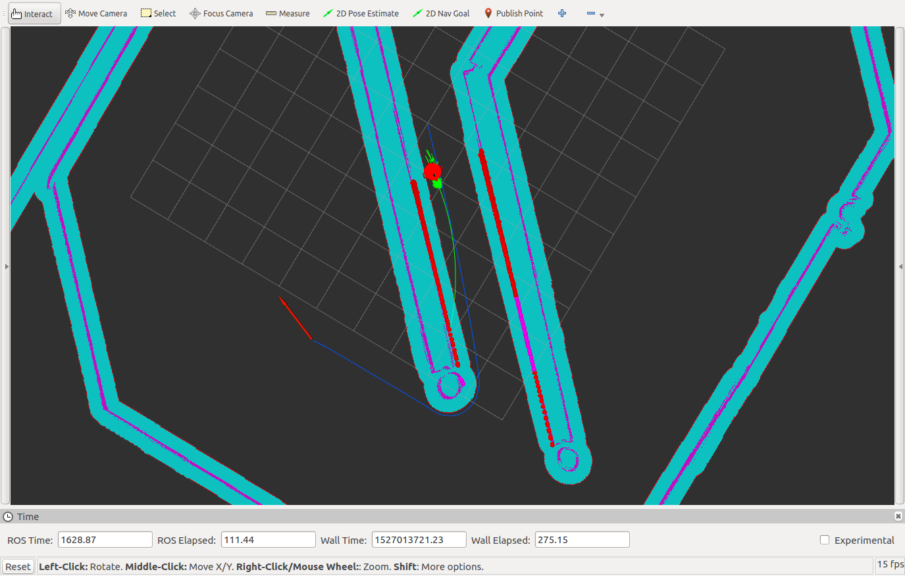
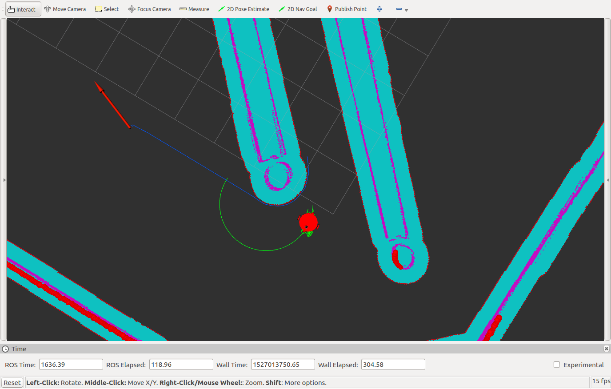
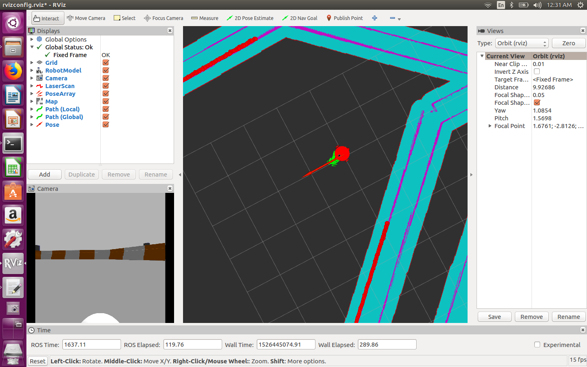

# Where Am I? Localization Project

Two different wheeled robot models were considered for performance evaluation. The robots were different in size, weight and wheel diameters. Using the Robot Operating System (ROS) and its packages, the robots were virtually constructed and launched in a simulation, then had its sensors and links finetuned for localization and navigation with a predefined map. The robots were lastly evaluated to reach a predefined goal position and goal orientation.


<p align="center">
  
</p>

<p align="center">
  
</p>

<p align="center">
  
</p>


# Project Setup
For this setup, catkin_ws is the name of the active ROS workspace. If
If you do not have an active ROS workspace, create one by:

```sh
$ mkdir -p ~/catkin_ws/src
$ cd ~/catkin_ws/
$ catkin_make
```

Now that you have a workspace, clone or download this repo into the src folder inside catkin_ws 
```sh
$ cd ~/catkin_ws/src
$ git clone https://github.com/Beshario/WhereAmI
```
Now install missing dependencies using rosdep install:
```sh
$ cd ~/catkin_ws
$ rosdep install --from-paths src --ignore-src --rosdistro=kinetic -y
```
Then build the project by:
```sh
$ cd ~/catkin_ws
$ catkin_make
```
Before you can run the repo, you will need to source the ROS environment variables. you need to source the ROS environment variables everytime a new terminal window is open.

```sh
source ~/catkin_ws/devel/setup.bash
```

To run the package to launch gazebo and rviz type

```sh
$ cd ~/catkin_ws
$ roslaunch udacity_bot udacity_world.launch
```

and start the localization, by writing the following in a new terminal window (after sourcing the environment variables).
```sh
$ cd ~/catkin_ws
$ roslaunch udacity_bot amcl.launch
```

In order to run a navigation test, open another terminal window:
```
$ cd ~/catkin_ws
$ rosrun udacity_bot navigation_goal
```


<p align="center">
  
</p>
